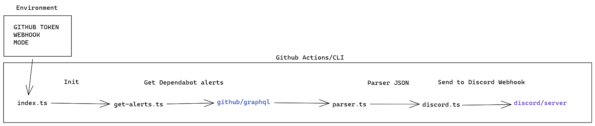
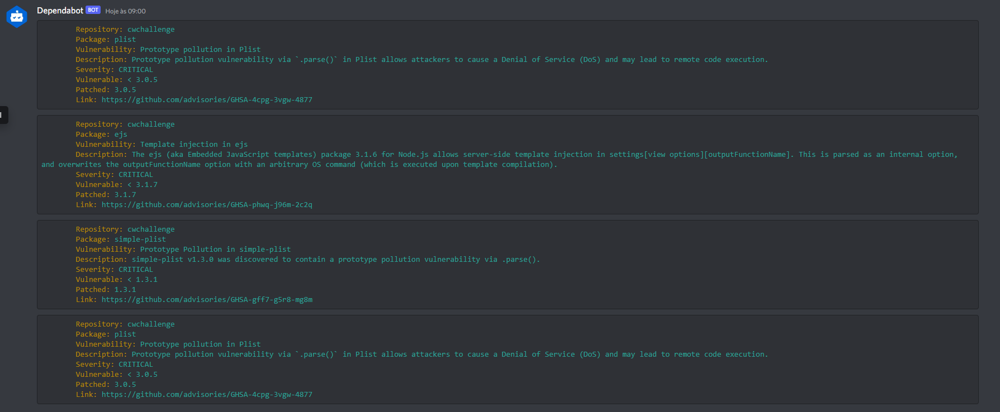
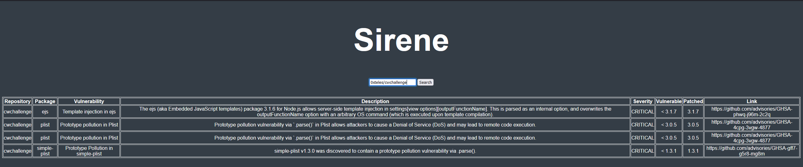
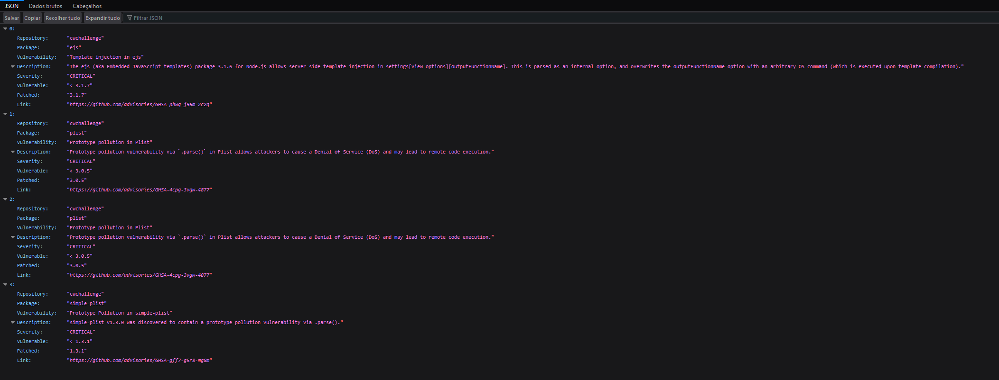

# Sirene
This is code to get dependabot alerts and send to Discord server or to fetch on API.

## How this works

The "Sirene" get alerts via Graphql with a github access token and send to Discord via webhook or put in own API, is your choose.  



The discord can used by two forms, via CLI or via Github Actions. And the API, you can use like UI or like REST API.

-------------------------------
## How to use - Github Actions

To use "Sirene" with Github Actions, you need create a new workflow like this. However, is necessary add your discord webhook and your github access token to Github Actions Secrets.

```yaml
name: 'Sirene'

on: [push]

jobs:
  main:
    runs-on: ubuntu-latest
    steps:
      - uses: 0xTeles/Sirene@stable
        with:
          TOKEN: ${{ secrets.TOKEN }}
          WEBHOOK: ${{ secrets.WEBHOOK }}

```
-------------------------------
## How to use - CLI / API

To use "Sirene" you need of **nodejs** and **yarn**. Follow the steps:

* Clone the repository;
* Go to folder of repository;
* Execute:
  ```bash 
  yarn && node build/index.js
   ```

If you selected CLI mode, as soon as you execute the command, you receive the alerts on your discord's channel. ***You only get alerts if the repository has one.***




If you selected API mode, you need go to **localhost:1337** and put the **owner/repository**. 




If you want to consume this api, just send a request like this:
```text
http://localhost:1337/api/:owner/:repository
```



-------------------------------

## How to configure

Before using, it is necessary to fill the **.ENV** file with your information. See:
* WEBHOOK=Your discord webhook;
* TOKEN=Your Github access token;
* REPOSITORY_NAME=Name of repository to take alerts;
* REPOSITORY_OWNER=Name of owner of repository to take alerts;
-------------------------------
## Resources

https://docs.github.com/en/actions

https://discord.com/developers/docs/resources/webhook

https://github.com/dependabot

https://www.kunalnagar.in/blog/send-github-dependabot-alerts-slack/
